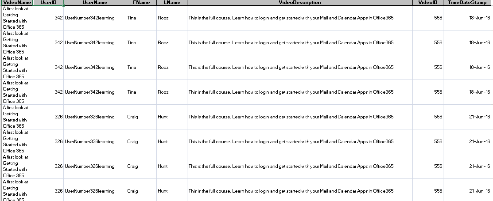
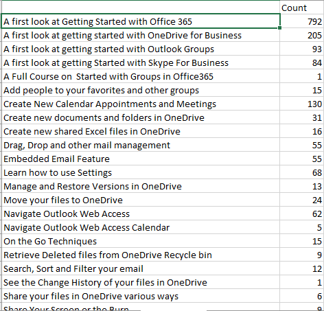
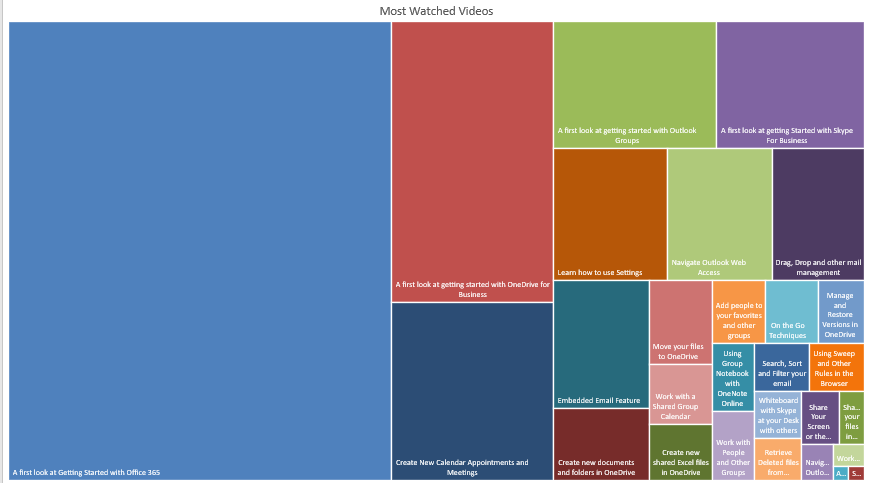

# Data-Visualizations
This repositery contains various sorts of dashboards and their underlying data which I've made using MS Excel.

# Main data of the file:

# Video data count:

# Chart of most viewed videos:

# Top 5% of users who watched the most videos:

# Bottom 5% of users who watched the least videos:

